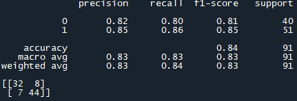
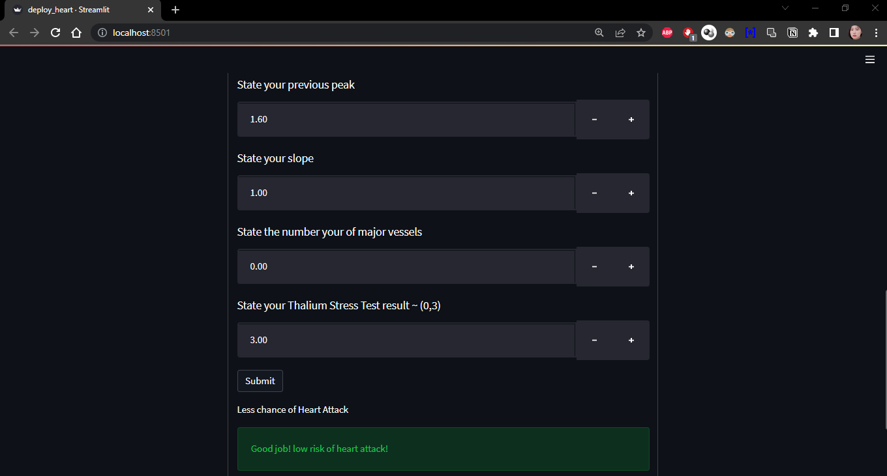

# Heart Attack Analysis and Prediction
 Machine learning model to predict patients' heart condition.

# Description 

This repository will contain 2 python files (train_heart.py and deploy_heart.py) 

train_heart.py contains the codes to train a machine learning model for our dataset (Heart Attack)

deploy_heart.py contains the codes to deploy and launch our saved model from train_heart.py 

I also included streamlit app for the convenience of user to input their health condition

# How to use 

1. Clone this repository and use the model.pkl (saved model) and mms_scaler.pkl (saved scaler) to deploy on your dataset
2. You can also use the deploy_heart.py to run streamlit
3. Run streamlit via conda prompt by activating the correct environment and working directory and run the code 
   "streamlit run deploy_heart.py"
4. Your browser will automatically redirected to streamlit local host and done! Streamlit is now usable.
5. Input the required data and click submit to view your result.

# Performance of my model

# Streamlit screenshot from my browser

# Credit

shout out to the owner of our dataset: https://www.kaggle.com/rashikrahmanpritom/heart-attack-analysis-prediction-dataset
